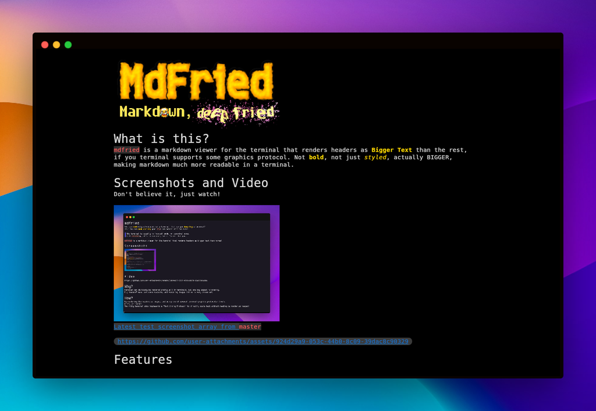

# What is this?

`mdfried` is a markdown viewer for the terminal that renders headers as **Bigger Text** than the rest, if your terminal supports some graphics protocol. Not **bold**, not just *styled*, actually BIGGER, making markdown much more readable in a terminal.

# Screenshots and Video

Don't believe it, just watch!



[Latest test screenshot array from `master`](https://benjajaja.github.io/mdfried-screenshots/)

https://github.com/user-attachments/assets/924d29a9-053c-44b0-8c09-39dac8c90329

# Features

* Big Headers™
  Headers are actually rendered as images, or with the [Text Sizing Protocol](https://sw.kovidgoyal.net/kitty/text-sizing-protocol/).
* Image previews with multiple graphics protocols
  Sixel, Kitty, and iTerm2 are supported in a long list of terminals. If no protocol is supported, falls back to [chafa](https://github.com/hpjansson/chafa/).
  See [ratatui-image](https://github.com/benjajaja/ratatui-image?tab=readme-ov-file#compatibility-matrix) to see if your terminal does even have graphics support, and for further details.
* Pager with basic unix-page and Vi-style keybindings
* Search
* Links
  * Opens URLs with xdg-open (or equivalent on macos/windows).
  * Can follow local `.md` links.
* URL opening
  * Can directly open a URL that serves a markdown document.
  * Can directly open `github:<owner>/<repo>`, if it contains a `README.md` on `master` or `main`.
  * Transform any URL before opening with a configurable command.
    For example, `url_transform_command = "readable | html2text"` first transforms the webpage into something like FireFox's "reader mode", and then converts to markdown.
* Syntax highlighting in codeblocks
* Mermaid diagram rendering 
  Via internal renderer (fast) or external mermaid-cli command (accurate).
* Theme [configuration](#configuration) support


# Installation

Packaged in distros:

* Rust cargo: `cargo install mdfried`
  * From source : `cargo install --path .`
  * Needs a chafa package with development headers, usually called something like `libchafa-dev`, `libchafa-devel`, or just `libchafa`, or even just `chafa`.
  * If chafa is not available at all, or you don't care about it because your terminal supports some graphic protocol, then use `--no-default-features`.
  * If `cargo install ...` fails, try it with `--locked`, and/or report an issue.
* Nix flake: `github:benjajaja/mdfried`
* Nixpkgs: [`mdfried`](https://search.nixos.org/packages?channel=unstable&query=mdfried)
* Arch, Manjaro, Parabola: `pacman -S mdfried` ([extra repository](https://archlinux.org/packages/extra/x86_64/mdfried/))
* FreeBSD: `pkg install mdfried`
* Ubuntu: [Download release .deb](https://github.com/benjajaja/mdfried/releases/latest)
* Mac: `brew install mdfried` or `port install mdfried` or [release binaries](https://github.com/benjajaja/mdfried/releases/latest)
* Windows: [Download release .exe](https://github.com/benjajaja/mdfried/releases/latest)

[](https://repology.org/project/mdfried/versions)

# Usage

### Running

```
mdfried ./path/to.md
```

If the font could not be autodetected, you may have to pick a font the first time.
You should pick the same font that your terminal is using, but you could pick any.
The font is rendered directly as a preview.
Once confirmed, the choice is written into the configuration file.

Use `--setup` to force the font-setup again if the font is not right (anymore).

See `--help` for all options, and `--print-config` to see a mostly complete [configuration](#configuration) example.

### Key bindings

The keybindings should follow the basics of general CLI pagers. Vi-style keybindings are 
prioritized, but "normal" keys should be usable as well.

Type `:help` in the program to see the exact list, or see [assets/docs/help.md](assets/docs/help.md).

### Configuration

`~/.config/mdfried/config.toml` is automatically created on first run.

`mdfried --print-config` prints out a full example config with a full theme.

### Changelog

See [CHANGELOG.md](./assets/docs/CHANGELOG.md).
