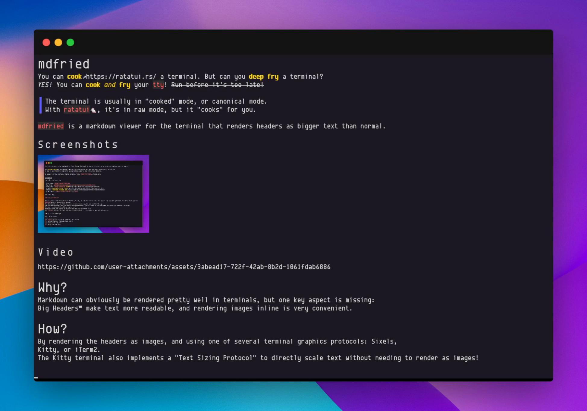

`mdfried` is a markdown viewer for the terminal that renders headers as **Bigger Text** than the
rest.

## Screenshots



[Latest test screenshot array from `master`](https://benjajaja.github.io/mdfried-screenshots/)

## Video

https://github.com/user-attachments/assets/924d29a9-053c-44b0-8c09-39dac8c90329

# Why?

You can *[cook](https://ratatui.rs/)* a terminal. But can you **deep fry** a terminal?
*YES!* You can **cook *and* fry** your `tty`! ~~Run before it's too late!~~

> The terminal is usually in "cooked" mode, or canonical mode.
> With `ratatui`🐁, it's in raw mode, but it "cooks" for you.

Markdown can obviously be rendered pretty well in terminals, but one key aspect is missing: 
Big Headers™ make text more readable, and rendering images inline is very convenient.

# How?

By rendering the headers as [images with ratatui](https://github.com/benjajaja/ratatui-image),
and using one of several terminal graphics protocols: Sixels, Kitty, or iTerm2.
The Kitty terminal also implements a [Text Sizing Protocol](https://sw.kovidgoyal.net/kitty/text-sizing-protocol/)
to directly scale text without needing to render as images!

See [ratatui-image](https://github.com/benjajaja/ratatui-image?tab=readme-ov-file#compatibility-matrix)
to see if your terminal does even have graphics support, and for further details.

In general, Kitty, WezTerm, iTerm2, Ghostty, Foot, `xterm -ti vt340`, Rio, *should* work.

On terminals without graphics whatsoever, like Alactritty, images are rendered with Chafa.

# Installation

Packaged in distros:

* Rust cargo: `cargo install mdfried`
  * From source : `cargo install --path .`
  * Needs a chafa package with development headers, usually called something like `libchafa-dev`, `libchafa-devel`, or just `libchafa`, or even just `chafa`.
  * If chafa is not available at all, or you don't care about it because your terminal supports some graphic protocol, then use `--no-default-features`.
  * If `cargo install ...` fails, try it with `--locked`, and/or report an issue.
* Nix flake: `github:benjajaja/mdfried`
* Nixpkgs: [`mdfried`](https://search.nixos.org/packages?channel=unstable&query=mdfried)
* Arch, Manjaro, Parabola: `pacman -S mdfried` ([extra repository](https://archlinux.org/packages/extra/x86_64/mdfried/))
* FreeBSD: `pkg install mdfried`
* Ubuntu: [Download release .deb](https://github.com/benjajaja/mdfried/releases/latest)
* Mac: `brew install mdfried` or `port install mdfried` or [realease binaries](https://github.com/benjajaja/mdfried/releases/latest)
* Windows: [Download release .exe](https://github.com/benjajaja/mdfried/releases/latest)

[](https://repology.org/project/mdfried/versions)

# Usage

### Running

```
mdfried ./path/to.md
```

Unless you're using Kitty version 0.40 or greater, or a terminal that does not support any graphics
protocol, the first time you run `mdfried` you may have to pick a font, if your terminal's font
could not be automatically detected.  
You should pick the same font that your terminal is using, but you could pick any.
The font is rendered directly as a preview.
Once confirmed, the choice is written into the configuration file.

Use `--setup` to force the font-setup again if the font is not right.

You can also pipe markdown into it:

```
readable https://lobste.rs | markdownify | mdfried
```

See `--help` for all options.

### Key bindings

Key | Description
----|------------
`q` or `Ctrl-c` | Quit and leave contents on terminal
`r` | Reload the file (unless piped stdin)
`j` | Scroll down one line
`k` | Scroll up one line
`d` or `Ctrl-d` | Scroll down half page
`u` or `Ctrl-u` | Scroll up half page
`f` or `PageDown` or `Space` | Scroll down a page
`b` or `PageUp` | Scroll up a page
`g` | Go to start of file
`G` | Go to end of file
`<number>G` or `<number>g` | Go to the string #\<number>
`/` | Search text
`n` | Jump to next match or link
`N` | Jump to previous match or link
`Enter` | Open selected link with `xdg-open` (linux) or `open` (macos)
`Esc` | Leave search or link modes

Entering a number before motion applies the motion that many times.

Mouse scroll only works if enabled in settings as `enable_mouse_capture = true`, but then you can't
select text.

### Configuration

`~/.config/mdfried/config.toml` is automatically created on first run.

`mdfried --print-config` prints out a full example config with a full theme.

### Changelog

See [CHANGELOG.md](./CHANGELOG.md).
