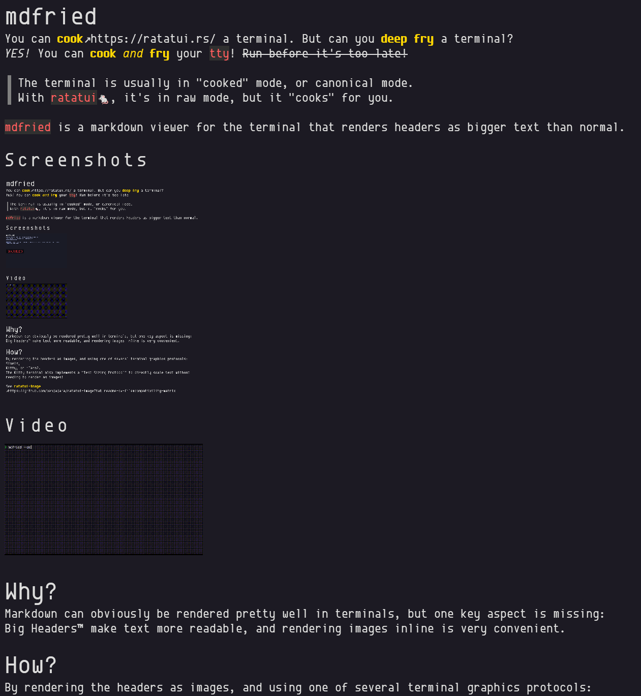

# mdfried

You can [cook](https://ratatui.rs/) a terminal. But can you **deep fry** a terminal?
*YES!* You can **cook *and* fry** your `tty`! ~~Run before it's too late!~~

> The terminal is usually in "cooked" mode, or canonical mode.
> With `ratatui`🐁, it's in raw mode, but it "cooks" for you.

`mdfried` is a markdown viewer for the terminal that renders headers as bigger text than normal.

## Screenshots



## Video


# Why?

Markdown can obviously be rendered pretty well in terminals, but one key aspect is missing: 
Big Headers™ make text more readable, and rendering images inline is very convenient.

# How?

By rendering the headers as images, and using one of several terminal graphics protocols: Sixels,
Kitty, or iTerm2.
The Kitty terminal also implements a "Text Sizing Protocol" to directly scale text without needing to render as images!

See [ratatui-image](https://github.com/benjajaja/ratatui-image?tab=readme-ov-file#compatibility-matrix)
to see if your terminal does even have graphics support, and for further details.

In general, Kitty, WezTerm, iTerm2, Ghostty, Foot, `xterm -ti vt340`, *should* work.

# Usage

### Installation

* Rust cargo: `cargo install mdfried`
* Nix flake: `github:benjajaja/mdfried` (`github:benjajaja/mdfried/v0.11.0`)
* Arch Linux: `paru -S mdfried` ([AUR](https://aur.archlinux.org/packages/mdfried))
* Windows: [Download release](https://github.com/benjajaja/mdfried/releases/latest)

### Running

```
mdfried ./path/to.md
```

Unless you're using Kitty version 0.40 or greater, or a terminal that does not support any graphics protocol, the first time you run `mdfried` you will have to pick a font.
You should pick the same font that your terminal is using, but you could pick any.
The font-setup screen lets you search the system fonts - you will want to pick the same font that your terminal is using.
The font is rendered directly as a preview.
Once confirmed, the choice is written into the configuration file.
Use `--setup` to force the font-setup again if the font is not right, or you switch terminals.

Press `q` or `Ctrl-c` to quit. `j`/`k` to scroll by lines, `d`/`u` to scroll by half pages, `f`/`b`/space to
scroll by pages, `g`/`G` to go to start/end of file. `r` reloads the file (if not using stdin pipe).
Mouse scroll also works.

### Configuration

`~/.config/mdfried/config.toml` is automatically created on first run.
The `[skin]` section can be configured to set various colors and styles.
See [termimad skin format](https://github.com/Canop/termimad/blob/main/examples/serialize-skin/skin.hjson)
for more information.

