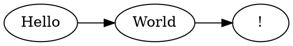

### Ada

```ada
with Ada.Text_IO;
procedure Hello is
begin
   Ada.Text_IO.Put_Line ("Hello, World!");
end Hello;
```

### Agda

```agda
module Hello where

open import IO

main : Main
main = run (putStrLn "Hello, World!")
```

### Asciidoc

```asciidoc
= Hello World
:author: Ada Lovelace

== Introduction

Hello, *World*!
```

### Assembly

```asm
section .data
    msg db "Hello, World!", 0

section .text
    global _start
_start:
    mov eax, 4
    mov ebx, 1
    mov ecx, msg
    int 0x80
```

### AWK

```awk
BEGIN {
    print "Hello, World!"
}
```

### Bash

```bash
#!/usr/bin/env bash
name="World"
echo "Hello, ${name}!"
```

### Batch

```batch
@echo off
set NAME=World
echo Hello, %NAME%!
pause
```

### C

```c
#include <stdio.h>

int main(void) {
    printf("Hello, World!\n");
    return 0;
}
```

### C#

```csharp
using System;

class Hello {
    static void Main() {
        Console.WriteLine("Hello, World!");
    }
}
```

### Caddyfile

```caddy
:8080 {
    respond "Hello, World!" 200
}
```

### Cap'n Proto

```capnp
@0xdbb9ad1f14bf0b36;

struct Person {
  name @0 :Text;
  age  @1 :UInt32;
}
```

### Cedar

```cedar
permit(
  principal == User::"alice",
  action == Action::"view",
  resource == Document::"readme"
);
```

### Cedar Schema

```cedarschema
entity User;
entity Document;
action view appliesTo {
  principal: User,
  resource: Document
};
```

### Clojure

```clojure
(ns hello.core)

(defn greet [name]
  (str "Hello, " name "!"))

(println (greet "World"))
```

### CMake

```cmake
cmake_minimum_required(VERSION 3.20)
project(Hello)

add_executable(hello main.c)
```

### COBOL

```cobol
IDENTIFICATION DIVISION.
PROGRAM-ID. HELLO.
PROCEDURE DIVISION.
    DISPLAY "Hello, World!".
    STOP RUN.
```

### Common Lisp

```commonlisp
(defun greet (name)
  (format t "Hello, ~A!~%" name))

(greet "World")
```

### C++

```cpp
#include <iostream>

int main() {
    std::cout << "Hello, World!" << std::endl;
    return 0;
}
```

### CSS

```css
body {
    font-family: sans-serif;
    color: #333;
    background-color: #fff;
}
```

### D

```d
import std.stdio;

void main() {
    writeln("Hello, World!");
}
```

### Dart

```dart
void main() {
  print('Hello, World!');
}
```

### Device Tree

```devicetree
/ {
    model = "Hello Board";
    compatible = "hello,world";

    leds {
        compatible = "gpio-leds";
    };
};
```

### Diff

```diff
--- a/hello.txt
+++ b/hello.txt
@@ -1,3 +1,3 @@
-Hello, World!
+Hello, Diff!
 Have a nice day.
```

### Dockerfile

```dockerfile
FROM alpine:3.18
RUN echo "Hello, World!"
CMD ["echo", "Hello, World!"]
```

### DOT/Graphviz



### Emacs Lisp

```elisp
(defun greet (name)
  (message "Hello, %s!" name))

(greet "World")
```

### Elixir

```elixir
defmodule Hello do
  def greet(name \\ "World") do
    IO.puts("Hello, #{name}!")
  end
end

Hello.greet()
```

### Elm

```elm
module Main exposing (main)

import Html exposing (text)

main =
    text "Hello, World!"
```

### Erlang

```erlang
-module(hello).
-export([start/0]).

start() ->
    io:fwrite("Hello, World!\n").
```

### Fish

```fish
function greet
    set name $argv[1]
    echo "Hello, $name!"
end

greet World
```

### F#

```fsharp
let greet name =
    printfn "Hello, %s!" name

greet "World"
```

### .gitattributes

```gitattributes
# Auto-detect text files
* text=auto

*.rs    text eol=lf
*.md    text eol=lf
*.png   binary
```

### Gleam

```gleam
import gleam/io

pub fn main() {
  io.println("Hello, World!")
}
```

### GLSL

```glsl
#version 450

out vec4 fragColor;

void main() {
    fragColor = vec4(1.0, 0.5, 0.2, 1.0);
}
```

### Go

```go
package main

import "fmt"

func main() {
    fmt.Println("Hello, World!")
}
```

### GraphQL

```graphql
query Greeting {
  hello(name: "World") {
    message
    timestamp
  }
}
```

### Groovy

```groovy
def greet(String name) {
    println "Hello, ${name}!"
}

greet("World")
```

### Haskell

```haskell
module Main where

greet :: String -> String
greet name = "Hello, " ++ name ++ "!"

main :: IO ()
main = putStrLn (greet "World")
```

### HCL

```hcl
variable "greeting" {
  type    = string
  default = "Hello, World!"
}

output "message" {
  value = var.greeting
}
```

### HLSL

```hlsl
float4 PSMain(float4 pos : SV_POSITION) : SV_Target {
    return float4(1.0, 0.5, 0.2, 1.0);
}
```

### HTML

```html
<!DOCTYPE html>
<html lang="en">
<head><title>Hello</title></head>
<body>
  <h1>Hello, World!</h1>
</body>
</html>
```

### Idris

```idris
module Main

greet : String -> String
greet name = "Hello, " ++ name ++ "!"

main : IO ()
main = putStrLn (greet "World")
```

### INI

```ini
[greeting]
message = Hello, World!
lang    = en

[server]
host = localhost
port = 8080
```

### Java

```java
public class Hello {
    public static void main(String[] args) {
        System.out.println("Hello, World!");
    }
}
```

### JavaScript

```javascript
function greet(name = "World") {
    return `Hello, ${name}!`;
}

console.log(greet());
```

### Jinja2

```jinja2

<!DOCTYPE html>
<html>
<body>
  <h1>Hello, {{ name }}!</h1>
</body>
</html>
```

### jq

```jq
{
  greeting: ("Hello, " + .name + "!"),
  upper:    (.name | ascii_upcase)
}
```

### JSDoc

```jsdoc
/**
 * Greets a person by name.
 * @param {string} name - The name to greet.
 * @returns {string} The greeting message.
 */
function greet(name) {
    return `Hello, ${name}!`;
}
```

### JSON

```json
{
  "greeting": "Hello, World!",
  "language": "en",
  "excited": true
}
```

### Julia

```julia
function greet(name="World")
    println("Hello, $name!")
end

greet()
```

### Just

```just
name := "World"

hello:
    echo "Hello, {{name}}!"

greet target:
    echo "Hello, {{target}}!"
```

### Kconfig

```kconfig
config HELLO_WORLD
    bool "Enable Hello World"
    default y
    help
      Prints "Hello, World!" at startup.
```

### KDL

```kdl
greeting {
    message "Hello, World!"
    lang "en"
    excited true
}
```

### Kotlin

```kotlin
fun greet(name: String = "World"): String =
    "Hello, $name!"

fun main() {
    println(greet())
}
```

### Lean

```lean
def greet (name : String) : String :=
  s!"Hello, {name}!"

#eval greet "World"
```

### Lua

```lua
local function greet(name)
    name = name or "World"
    print("Hello, " .. name .. "!")
end

greet()
```

### Make

```make
NAME := World

.PHONY: hello
hello:
	echo "Hello, $(NAME)!"
```

### Markdown

```markdown
# Hello, World!

Welcome to this **document**.

- Item one
- Item two
```

### MATLAB

```matlab
function greet(name)
    if nargin < 1
        name = 'World';
    end
    fprintf('Hello, %s!\n', name);
end
```

### Meson

```meson
project('hello', 'c', version: '0.1')

executable('hello',
  sources: 'main.c',
  install: true,
)
```

### Ninja

```ninja
rule cc
  command = gcc -o $out $in
  description = CC $out

build hello: cc hello.c
```

### Nix

```nix
{ pkgs ? import <nixpkgs> {} }:

pkgs.writeShellScriptBin "hello" ''
  echo "Hello, World!"
''
```

### Objective-C

```objc
#import <Foundation/Foundation.h>

int main(void) {
    NSLog(@"Hello, World!");
    return 0;
}
```

### OCaml

```ocaml
let greet name =
  Printf.printf "Hello, %s!\n" name

let () = greet "World"
```

### Odin

```odin
package main

import "core:fmt"

main :: proc() {
    fmt.println("Hello, World!")
}
```

### Perl

```perl
#!/usr/bin/env perl
use strict;
use warnings;

sub greet { "Hello, $_[0]!" }
print greet("World"), "\n";
```

### PHP

```php
<?php

function greet(string $name = 'World'): string {
    return "Hello, {$name}!";
}

echo greet() . PHP_EOL;
```

### PostScript

```postscript
%!PS
/Helvetica findfont 24 scalefont setfont
100 700 moveto
(Hello, World!) show
showpage
```

### PowerShell

```powershell
function Invoke-Greet {
    param([string]$Name = "World")
    Write-Output "Hello, $Name!"
}

Invoke-Greet
```

### Prolog

```prolog
:- initialization(main, main).

greet(Name) :-
    format("Hello, ~w!~n", [Name]).

main(_) :- greet('World').
```

### Protocol Buffers

```proto
syntax = "proto3";

message Greeting {
  string name    = 1;
  string message = 2;
}

service Greeter {
  rpc SayHello (Greeting) returns (Greeting);
}
```

### Python

```python
def greet(name: str = "World") -> str:
    return f"Hello, {name}!"

print(greet())
```

### Tree-sitter Query

```query
(function_definition
  name: (identifier) @function.name
  parameters: (parameters) @function.params
  body: (block) @function.body)
```

### R

```r
greet <- function(name = "World") {
  cat(sprintf("Hello, %s!\n", name))
}

greet()
```

### Regular Expression

```regex
# Match a greeting
^Hello,\s+(\w+)!$

# Match an email address
[a-zA-Z0-9._%+\-]+@[a-zA-Z0-9.\-]+\.[a-zA-Z]{2,}
```

### Rego

```rego
package greet

default allow := false

allow if {
    input.user == "alice"
    input.action == "read"
}
```

### ReScript

```rescript
let greet = (name: string): string =>
  "Hello, " ++ name ++ "!"

let () = Js.log(greet("World"))
```

### RON

```ron
(
    greeting: "Hello, World!",
    count: 1,
    tags: ["hello", "world"],
)
```

### Ruby

```ruby
def greet(name = "World")
  "Hello, #{name}!"
end

puts greet
```

### Rust

```rust
fn greet(name: &str) -> String {
    format!("Hello, {name}!")
}

fn main() {
    println!("{}", greet("World"));
}
```

### Scala

```scala
object Hello extends App {
  def greet(name: String = "World"): String =
    s"Hello, $name!"

  println(greet())
}
```

### Scheme

```scheme
(define (greet name)
  (string-append "Hello, " name "!"))

(display (greet "World"))
(newline)
```

### SCSS

```scss
$primary: #333;
$bg: #fff;

body {
  font-family: sans-serif;
  color: $primary;
  background-color: $bg;
}
```

### Solidity

```solidity
// SPDX-License-Identifier: MIT
pragma solidity ^0.8.0;

contract Hello {
    function greet() public pure returns (string memory) {
        return "Hello, World!";
    }
}
```

### SPARQL

```sparql
PREFIX schema: <https://schema.org/>

SELECT ?name ?greeting
WHERE {
  ?person schema:name ?name .
  BIND(CONCAT("Hello, ", ?name, "!") AS ?greeting)
}
```

### SQL

```sql
CREATE TABLE greetings (
    id      INTEGER PRIMARY KEY,
    message TEXT NOT NULL
);

INSERT INTO greetings (message) VALUES ('Hello, World!');
SELECT message FROM greetings;
```

### SSH Config

```ssh-config
Host dev
    HostName dev.example.com
    User alice
    IdentityFile ~/.ssh/id_ed25519
    Port 22
```

### Starlark

```starlark
def greet(name = "World"):
    return "Hello, " + name + "!"

greeting = greet()
print(greeting)
```

### Styx

```styx
{
  title = "Hello World";
  layout = "default.html";
  content = "Hello, World!";
}
```

### Svelte

```svelte
<script>
  let name = "World";
</script>

<h1>Hello, {name}!</h1>

<style>
  h1 { color: #333; }
</style>
```

### Swift

```swift
func greet(_ name: String = "World") -> String {
    "Hello, \(name)!"
}

print(greet())
```

### Text Proto

```textproto
greeting {
  name: "World"
  message: "Hello, World!"
  excited: true
}
```

### Thrift

```thrift
namespace py hello

struct Greeting {
    1: string name,
    2: string message,
}

service Greeter {
    Greeting sayHello(1: string name),
}
```

### TLA+

```tlaplus
---- MODULE Hello ----
EXTENDS Naturals, Sequences

VARIABLE state

Init == state = "hello"
Next == state' = "world"
Spec == Init /\ [][Next]_state
====
```

### TOML

```toml
[greeting]
message = "Hello, World!"
language = "en"

[server]
host = "localhost"
port = 8080
```

### TSX

```tsx
interface Props {
    name?: string;
}

export function Hello({ name = "World" }: Props) {
    return <h1>Hello, {name}!</h1>;
}
```

### TypeScript

```typescript
function greet(name: string = "World"): string {
    return `Hello, ${name}!`;
}

console.log(greet());
```

### Typst

```typst
#set document(title: "Hello")

= Hello, World!

Welcome to #emph[Typst].
```

### Uiua

```uiua
"Hello, World!"
&p
```

### Visual Basic

```vb
Module Hello
    Sub Main()
        Dim name As String = "World"
        Console.WriteLine($"Hello, {name}!")
    End Sub
End Module
```

### Verilog

```verilog
module hello;
  initial begin
    $display("Hello, World!");
    $finish;
  end
endmodule
```

### VHDL

```vhdl
library IEEE;
use IEEE.STD_LOGIC_1164.ALL;

entity hello is
end hello;

architecture sim of hello is
begin
  process begin
    report "Hello, World!";
    wait;
  end process;
end sim;
```

### Vimscript

```vim
function! Greet(name)
  echo "Hello, " . a:name . "!"
endfunction

call Greet("World")
```

### Vue

```vue
<template>
  <h1>Hello, {{ name }}!</h1>
</template>

<script setup>
const name = "World";
</script>
```

### WIT

```wit
package hello:world@0.1.0;

interface greeter {
  greet: func(name: string) -> string;
}

world hello {
  export greeter;
}
```

### x86 Assembly

```x86asm
section .data
    msg db "Hello, World!", 10
    len equ $ - msg

section .text
    global _start
_start:
    mov rax, 1
    mov rdi, 1
    mov rsi, msg
    mov rdx, len
    syscall
```

### XML

```xml
<?xml version="1.0" encoding="UTF-8"?>
<greeting>
  <message lang="en">Hello, World!</message>
</greeting>
```

### YAML

```yaml
greeting:
  message: Hello, World!
  language: en
  excited: true
```

### Yuri

```yuri
import "std"

fn main() {
  std.print("Hello, World!")
}
```

### Zig

```zig
const std = @import("std");

pub fn main() !void {
    const stdout = std.io.getStdOut().writer();
    try stdout.print("Hello, World!\n", .{});
}
```

### Zsh

```zsh
#!/usr/bin/env zsh

greet() {
    local name=${1:-World}
    echo "Hello, ${name}!"
}

greet
```

### nginx

```nginx
server {
    listen 80;
    server_name example.com;

    location / {
        return 200 "Hello, World!\n";
    }
}
```
